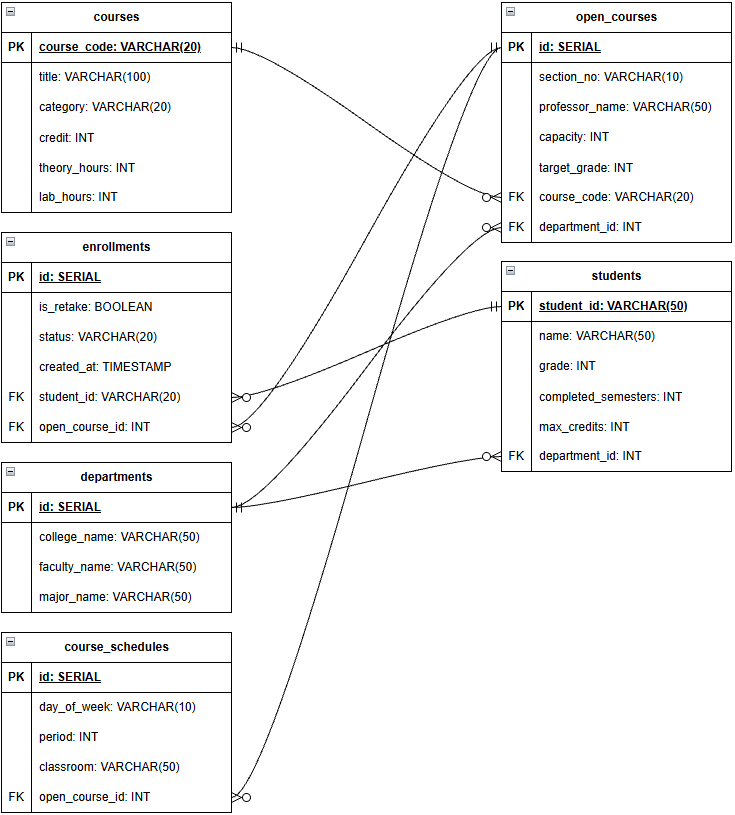

# 개인 조건 맞춤형 과목 추천 및 시간표 설계 웹 플랫폼

## 팀 정보

- **팀명:** 거의 다 됐죠

### 팀원

| 학번 | 이름 | 역할 |
| :---: | :--- | :--- |
| 2461071 | 이종호 | 팀장 |
| 2261064 | 김도현 | 부팀장 |
| 2161011 | 이정훈 | 팀원 |
| 2261066 | 오도현 | 팀원 |
| 2461084 | 흐엥 택 카잉 | 팀원 |

---

## 프로젝트 주소

- **GitHub:** [course-recommendation-timetable](https://github.com/Jongho-Lee-dev/course-recommendation-timetable)
- **서비스:** [서비스 바로가기](https://course-recommendation-timetable.vercel.app/)
- **Backend API:** [FastAPI 서버](https://course-recommendation-timetable.onrender.com)

---

## 프로젝트 내려받기

GitHub 저장소를 Clone하여 프로젝트를 로컬 환경에 내려받습니다.

```bash
git clone https://github.com/Jongho-Lee-dev/course-recommendation-timetable.git
cd course-recommendation-timetable
```

---

## 프로젝트 실행

### Frontend

`frontend` 폴더로 이동한 후 필요한 패키지를 설치하고 개발 서버를 실행합니다.

```bash
cd frontend
npm install
npm run dev
```

### Backend

`backend` 폴더로 이동한 후 Python 가상환경을 생성하고 필요한 패키지를 설치한 뒤 서버를 실행합니다.

```powershell
cd backend
python -m venv venv
venv\Scripts\activate
pip install -r requirements.txt
uvicorn app.main:app --reload
```

### Redis

로컬 개발 환경에서는 Docker를 사용하여 Redis를 실행합니다.

```bash
docker run -d --name my-redis -p 6379:6379 redis
```

Redis 컨테이너가 생성된 이후에는 다음 명령어로 실행할 수 있습니다.

```bash
docker start my-redis
```

실행 여부는 다음 명령어로 확인합니다.

```bash
docker ps
```

### 환경변수

Backend 실행에 필요한 환경변수는 `backend/.env` 파일에서 관리합니다.

```env
UPSTASH_REDIS_REST_URL=https://arriving-llama-132373.upstash.io
UPSTASH_REDIS_REST_TOKEN=발급받은_토큰
```

> `UPSTASH_REDIS_REST_TOKEN`은 Redis 인증 정보이므로 GitHub에 업로드하지 않습니다.

---

## 실행 확인

프론트엔드와 백엔드 서버가 정상적으로 실행되면 개발 환경이 구성됩니다.

- **Frontend:** `npm run dev` 실행 후 터미널에 표시되는 주소로 접속
- **Backend:** http://127.0.0.1:8000
- **API 문서:** http://127.0.0.1:8000/docs

---

## Redis

수강신청 과정에서 발생하는 다수 사용자의 동시 요청을 안정적으로 처리하기 위해 Redis를 활용했습니다.

### Redis 구성

- **로컬 개발 환경:** Docker Redis
- **배포 환경:** Upstash Redis
- **Backend:** Python + FastAPI
- **Redis Client:** `upstash-redis`

### Redis 적용 목적

수강신청은 여러 사용자가 동시에 같은 강의에 요청을 보낼 수 있기 때문에 강의 정원 관리 과정에서 동시성 문제가 발생할 수 있습니다.

Redis를 활용하여 수강 정원과 수강신청 요청을 처리하고, 다수 사용자가 동시에 접속하는 상황을 고려한 수강신청 처리 구조를 구현했습니다.

### 배포 환경

배포된 FastAPI 서버에서는 **Upstash Redis**를 사용합니다.

```text
FastAPI
   │
   ▼
Upstash Redis
   │
   ├── 수강 정원 관리
   └── 동시 수강신청 요청 처리
```

Redis 접속 정보는 환경변수로 관리하여 GitHub에 인증 정보가 노출되지 않도록 구성했습니다.

---

## k6

k6를 활용하여 다수 사용자의 동시 접속 상황을 가정한 부하 테스트를 진행합니다.

### k6 설치

Windows PowerShell에서 다음 명령어를 실행합니다.

```powershell
winget install k6 --source winget
```

### 버전 확인

k6가 정상적으로 설치되었는지 확인합니다.

```bash
k6 version
```

### k6 실행

k6 테스트 스크립트를 실행할 때 다음 명령어를 사용합니다.

```bash
k6 run 파일이름
```

테스트 결과는 터미널에서 확인할 수 있습니다.

---

## Database

본 프로젝트는 **Supabase PostgreSQL**을 데이터베이스로 사용합니다.

### ERD



---

## 주요 기능

---

## 기술 스택

### Frontend

- React
- TypeScript
- Zustand

### Backend

- Python
- FastAPI

### AI

- Gemini Flash API

### Database / In-Memory

- PostgreSQL
- Supabase
- Redis

### Test / Infrastructure

- k6
- Docker

### Development Tools

- VS Code
- Git
- GitHub